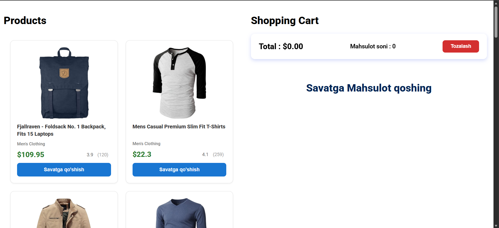
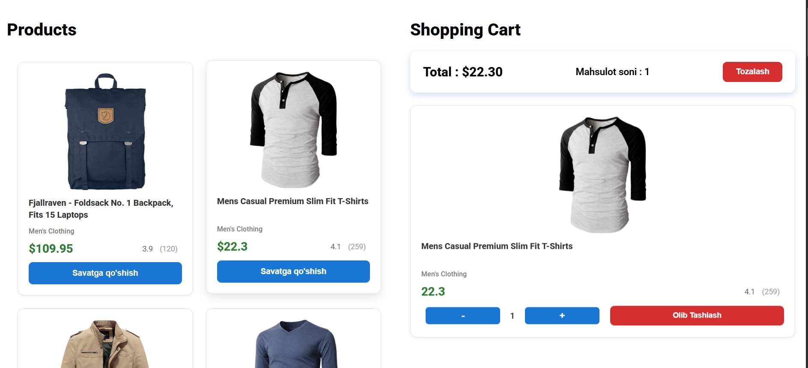

# Mini Marketplace - Shopping Cart Application

**Ism Familiya:** Javohir Suvonov

**Vazifa:** Frontend Intern - Mini Marketplace loyihasi

##  Bajarilish Vaqti

**Jami vaqt:** 6 soatga yaqin

### Asosiy Funksiyalar:
- ✅ Mahsulotlar ro'yxatini ko'rish (FakeStore API)
- ✅ Mahsulotlarni savatga qo'shish
- ✅ Savat ichida mahsulot sonini o'zgartirish (+/-)
- ✅ Mahsulotlarni savatdan o'chirish
- ✅ Umumiy summa va mahsulotlar sonini ko'rsatish
- ✅ LocalStorage orqali savatni saqlash
- ✅ Responsive dizayn (Desktop va Mobile)

## 💻 Texnologiyalar

- **React** (Vite)
- **Vanilla JavaScript** (mahsulotlarni yuklash)
- **CSS3** (Grid, Flexbox)
- **LocalStorage** (ma'lumotlarni saqlash)
- **FakeStore API** (https://fakestoreapi.com/products)

## 🚀 O'rnatish va Ishga Tushirish
```bash
# Loyihani klonlash
git clone https://github.com/javohir-tech/mini-marketplace

npm install

npm run dev

npm run build
```

## Qiyinchiliklar va Yechimlar

### 1. **LocalStorage bilan ishlash**
**Muammo:** React va Vanilla JS o'rtasida ma'lumotlarni sinxronlashtirish qiyin bo'ldi.

**Yechim:** `CustomEvent` ishlatib, `cartUpdated` event yaratdim va ikki tomon ham uni tinglab turdi.
```javascript
window.dispatchEvent(new Event("cartUpdated"))
window.addEventListener('cartUpdated', kuzat)
```

### 2. **Ui kutubxonalarsiz ancha qiyin boldi**
**Muammo:** UI kutubxonalar da ishlatadigan css hossalarni css kodini qanday ishlatishni topishga togri keldi

**Yechim:** CSS bilimlarni yanada oshirdim

### 3. **CSS Styling**
**Muammo:** Tugmalarga hover/active effektlar 

**Yechim:** CSS transitions va transform ishlatdim:
```css
button:hover {
  transform: translateY(-2px);
  box-shadow: 0 4px 8px rgba(0,0,0,0.2);
}
```

## 📸 Interfeys Skrinshotlari

### Desktop Ko'rinish

*Mahsulotlar 2 ustunda ko'rsatiladi*


*Savat va umumiy summa*

### Mobile Ko'rinish

*Mobilda 1 ustunda*

### 

*Mahsulotni savatga qo'shish jarayoni*

##  Demo Havola

**Live Demo:** [https://mini-marketplace-cyan.vercel.app/](https://mini-marketplace-cyan.vercel.app/)

**GitHub Repository:** [https://github.com/javohir-tech/mini-marketplace](https://github.com/javohir-tech/mini-marketplace)

##  Xususiyatlar

### Products Bo'limi (Vanilla JS)
- FakeStore API dan mahsulotlarni yuklash
- Grid layout bilan chiroyli ko'rinish
- Hover effektlari
- "Savatga qo'shish" tugmasi

### Cart Bo'limi (React)
- useState va useEffect hooks
- LocalStorage bilan integratsiya
- Mahsulot sonini +/- bilan boshqarish
- Umumiy summa hisobi
- "Tozalash" funksiyasi

### Responsive Dizayn
- Desktop: 2 ustun
- Tablet: 2 ustun
- Mobile: 1 ustun

## 🎓 O'rgangan Narsalar

1. ✅ React Hooks (useState, useEffect)
2. ✅ Vanilla JS bilan API dan ma'lumot olish
3. ✅ LocalStorage CRUD operatsiyalari
4. ✅ CSS Grid va Flexbox
5. ✅ Event Listeners va Custom Events
6. ✅ Component-based architecture
7. ✅ Error Handling va Loading states
8. ✅ Responsive Web Design


💡 **Eslatma:** Bu loyiha Frontend Intern test topshirig'i sifatida bajarilgan.